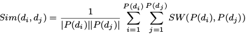

**Representation learning of drug and disease terms for drug repositioning**
-Sahil Manchanda, Ashish Anand

Manchanda, Sahil, and Ashish Anand. "Representation learning of drug and disease terms for drug repositioning." *Cybernetics (CYBCONF), 2017 3rd IEEE International Conference on*. IEEE, 2017.

- Drug repositioning exploits two major aspects associated with drugs and disease: existence of similarity among drugs and among disease due to their shared involved genes or pathways or common biological effects.

drugs-disease (via genes or pathways)

- In this work we propose a novel way of representation learning to obtain features of drugs and disease by combining complementary information available in unstructured texts and structured dataset.
- the case studies on Alzheimer's and Hypertension disease have shown that the predicted associations are matching with the existing knowledge.

Introduction

- among all the drugs which have been approved by the US Food and Drug Administration, approximately 30% of them were the result of drug repositioning.
- First, drugs often bind to multiple targets resulting into various biological effects including side-effects.
- Second, a biological target of a drug which is relevant to a particular disease, may also be directly or indirectly associated with other disease.
- In other words, overlapping pathways or common associated targets between various disease are important factors and thereby making it possible that an approved drug for one disease may be useful in treating a similar disease.

1. we learn vector representation of drugs and diseases by using the knowledge present in literature
2. update vectors to accommodate various similarity measures of drugs and diseases respectively.
3. the resultant drug and disease vector representation are not necessarily in the same vector space -> matrix completion approach to learn a projection matrix between drug and disease vector space.
4. validation: 10 fold cross validation and top k rank threshold methods and compare it with 3 other competitive methods. -> out study shows that all our top ten drugs predicted for Alzheimer's disease are approved to treat neurodegenerative disease.

Materials and methods

- dataset:

- - Drug-disease association data - PREDICT : contains 1933 drug-disease associations between 593 drugs(Drug Bank) and 313 disease(OMIN)
  - Drug-side effect data - SIDER
  - Chemical fingerprint of Drugs - record of component fragment present in their chemical structure, DrugBank
  - Disease associated genes - DisGeNet

- similarity measure:

- - drugs : side-effects, chemical structure, target protein

  - - drugs cause side-effects when they bind to off-target apart from their desired on-targets. Under the assumption that if 2 drugs share side-effects and hence off-targets, there is a possibility that they might share on-targets which can be used to cure disease. sim = intersect of side-effects / union of side-effects between 2 drugs.

    - tanimoto coefficient can be effective measure to calculate similarity between two chemicals based on their structures.

    - if two drugs share same targets, the probability of them causing the similar effect may also increase. 

      
      P(d) = set of genes associated with drug d, SW = Smith-Waterman sequence alignment score.

  - disease : disease phenotypes, associated genes

  - - A phenotypic feature is an observable biological or clinical characteristic of a disease. The similarity is collected from MIMMiner tool. The tool measures disease similarity by computing similarity between MeSH terms that appear in the medical description of diseases in the OMIM database.
    - disease causing or associated genes are collected from DisGeNET.

Method

​     

1. obtain vector representation of drugs and diseases using neural embedding method:

2. - each disease in the corpus is mapped to a concept unique identifier(CUI) by using UMLS meta theasaurus.
   - word vector representation of each drug and disease is obtained by training Pubmed Corpus using word2Vec Python library.
   - To train vectors, we set window size to 5. We have experimented using various vector dimensions ranging from 100 to 200.

3. update these representations using similarity scores calculated from the various structured datasets:

4. - optimization by Theano python library

5. learn a projection matrix between the two vector-spaces so that a final association score between drug-disease pair can be obtained.:

6. - the projection matrix should be such that the projected drug vectors are geometrically close to vectors of their well known disease vectors. the drugs that are in proximity in the directions of their feature vectors may share diseases and vice-versa.
   - use inductive matrix completion approach

Experiments

1. baseline methods:

2. 1. compare methods

   2. 1. HGBI: create heterogeneous network of two different type of nodes(drugs, targets). existence of edge depends on drug-drug similarities, target-target similarities and drug-target interactions.
      2. MBIRW: create two separate networks on drugs and disease. perform random walk on these two networks to get scores for drug disease associations.
      3. TP-NRWH: uses random walk method but on single heteogeneous drug-disease network

Results

- vector representation: experiment with varying length of feature vectors between 100 and 200

AUC: 0.77 -> update word vectors based on similarity scores -> AUC:0.86

- MBIRW, TP-NRWH showed better performance

​     