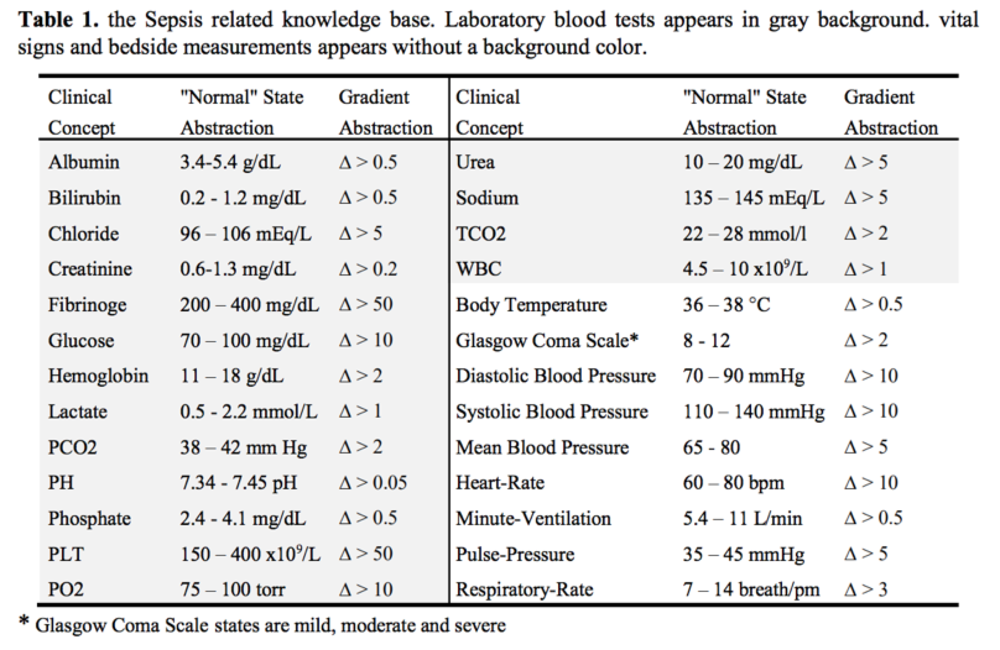

## Temporal Pattern Discovery for Accurate Sepsis Diagnosis in ICU Patients.

Temporal dataset형태로 분석하고, 대상 질병이 Sepsis이며, MIMIC을 활용한 논문

[Sheetrit, Eitam, et al. "Temporal Pattern Discovery for Accurate Sepsis Diagnosis in ICU Patients." *arXiv preprint arXiv:1709.01720* (2017).][https://arxiv.org/pdf/1709.01720.pdf]

- Aim: Use knowledge-based temporal abstraction to create meaningful interval-based abstractions and to discover frequent interval-based patterns.
- Dataset : 2,560 (1,041 septic and 1,519 non-septic) cases from MIMIC-III (**15 years old or older, stayed in the ICU at least 4 days, who developed sepsis on the third day or later**)
- Result : Temporal patterns of septic patients during the last 6 and 12 hours before onset of sepsis is significantly different from non-septic patients. So these patterns might serve as effective features for classification methods.

**Sepsis**

- Importance: Sepsis is one of the leading causes of mortality among patients in intensive care units, and responsible for 10% of the ICU admissions.
- Treatment: antibiotics and intravenous fluids.
- Diagnosis: Abnormal or rapid change in blood pressure, body temperature, heart rate, respiratory rate
  - SIRS(Systemic Inflammatory Response Syndrome): temperature > 38C 
     or  temperature <36C, heart rate > 90/min, respiratory rate > 20/min 
     or Paco2 <32mmHg, WBC(white blood cell) count >12,000/mm3
     or WBC < 4,000/mm3
     or WBC > 10% immature bands
  - qSOFA(quick SOFA): respiratory rate >= 22/min, systolic blood pressure <= 100mmHG, altered mentation

**Data**

- **lab tests** : albumin, bilirubin, chloride, creatinine, fibrinogen, glucose, hemoglobin, lactate, PCO2, PH, phosphate, platelets, PO2, sodium, TCO2, urea, and white blood cell count
- **chart items** : blood pressure (systolic, diastolic, mean, and pulse pressure), heart rate, minute ventilation and respiratory rate, body temperature, and Glasgow Coma Scale (GCS)
   

- **Each concept abstracted into three possible states (Low, Normal, High), three possible gradient values (Decreasing, Increasing, Stable) by Knowledge-based Temporal Abstraction from sepsis domain expert.**   
- **Sepsis onset time is not included in the MIMIC-III. But patients with sepsis were identified using the ICD-9 (995.91 and 995.92) in discharge form and whether they received antibiotics during their stay in the ICU. Onset time = the earliest between being prescribed antibiotics and the time the qSOFA criteria indicated sepsis.**

Experiment 1: Examine the behavior of septic patients in the last 12 hours prior to sepsis onset, compared to non-septic patients.

Experiment 2: Examine the behavior of septic patients in the last 6 hours prior to sepsis onset, compared to non-septic patients.

Pattern Discovery by KarmaLego – Search for time-interval relations patterns