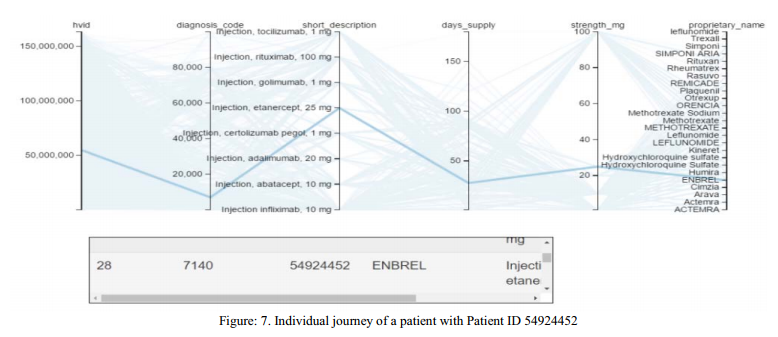
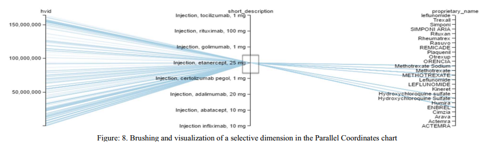
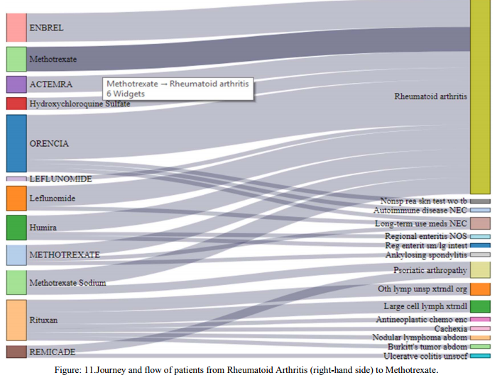

### Patient Journey Visualizer: A Tool for Visualizing Patient Journeys

Paper Review About : Kaushal, Kulendra Kumar, et al. "Patient Journey Visualizer: A Tool for Visualizing Patient Journeys." Machine Learning and Data Science (MLDS), 2017 International Conference on. IEEE, 2017.

Aim : We aim to **understand patient journeys via powerful visualization charts**, that help mine patterns in Big-Data relating to patients at both the individual and aggregate levels.

Data : diagnoses, procedures performed on patients, and medicines (from insurance claims)

**Patient Journey란,**
Document how patients move in a healthcare system from sickness to recovery. 헬스케어 시스템 내부에서 환자가 어떤 케어를 받으면서 회복하는지를 기록하는 것.
Patient journeys are likely to involve all the sequential steps starting from visiting doctors, filling prescriptions at pharmacies, getting lab tests done, to getting treatment, and recovering from sickness.

**Visualization을 하는 목표는 다양한 질병, 약물의 성능, 그리고 치료 과정을 이해하는데 도움을 주기 위해서.**
The PJV tool uses Parallel coordinate, Sankey and Sunburst charts, where these charts can significantly help us in understanding different diseases, the performance of various drugs against diseases, and procedures used in treating different diseases.

Charts(차트 종류) - 전제 JSON 형태로 데이터입력

1. **Parallel Coordinates - Patient ID, ICD9 codes, HCPCs, Date of Diagnoses, Date of Procedures, NDCs, age, gender**

   {

   ​	“Patient_ID” : 환자 식별자,
   ​	“Diagnosis_Code” : ICD-9 code,
   ​	“Diagnosis_Date” : 진단 날짜,
   ​	“Procedure_Code” : 치료법 code,
   ​	“Procedure_Date” : 치료 날짜,
   ​	“Drug_NDC” : NDC

   }
   환자 개인단위의 정보를 시각화. 패턴 분석에 용이하다. ex) a medicine’s performance across patients diagnosed with the same disease, a medicine’s performance across several demographic variables
   

   Brushing을 통해 특정 데이터 Range 내 포함되는 환자군만 확인 할 수 있다.

   

1. **Sankey Charts - ICD9 codes, HCPCs**
   환자 그룹단위의 정보를 시각화. 특정 진단이나 약물, 치료법에 대한 흐름을 보여줄 수 있다.
   Show flows of a certain number of patients over specific diagnoses made and medicines refilled, specific procedures conducted.
   {

   ​	“nodes” : [ //진단, 치료, 처방약 이 될 수 있다.
   ​		{"name” : “node_0”},
   ​		{"name” : “node_1”},
   ​	],

   ​	"links” : [
   ​			{"source” : “node_0”, “target”: “node_1”, “value”: “2”}
   ​	]
   }

   사용자는 기준 날짜(D1)와, 관찰기간을 정한다. 지정한 기준 날짜를 기준으로 전/후 관찰기간에 대한 시각화를 진행한다. 시각화 기간 = [D1 - 관찰기간 ~ D1 + 관찰기간] 
   

2. **Sunburst - ICD9 codes, HCPCs, NDCs, the number of patients**
   계층 구조 정보를 시각화. 
   또한 연속으로 발병되는 질병을 그룹화하기 용이하다. (발병 가능한 질병을 예측하는데 도움을 줄 수 있다.)
   It can also help in grouping various diseases that occur in a sequence.Overall, this chart could help stakeholders like insurers and physicians in predicting illnesses that could affect several patients.

   {

   ​	“name”: “Patient Journey”,

   ​	“children” : [

   ​		{“name”: “diagonosis_1”, 
   ​		“children”: [

   ​				{“name”: “medication_1”, “size”: 3938}
   ​			]
   ​		}

   ​	]

   }